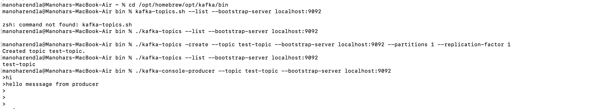

# Kafka Zooper installation on Mac

### Steps to install

```
/bin/bash -c "$(curl -fsSL https://raw.githubusercontent.com/Homebrew/install/HEAD/install.sh)"
brew install zookeeper
brew services start zookeeper
brew install kafka
brew services start kafka
zkServer status
cd /opt/homebrew/opt/kafka/bin

./kafka-topics --list --bootstrap-server localhost:9092

./kafka-topics -create --topic test-topic --bootstrap-server localhost:9092 --partitions 1 --replication-factor 1

./kafka-topics --list --bootstrap-server localhost:9092
./kafka-console-producer --topic test-topic --bootstrap-server localhost:9092
./kafka-console-consumer --topic test-topic --bootstrap-server localhost:9092 --from-beginning
```

### Results:




